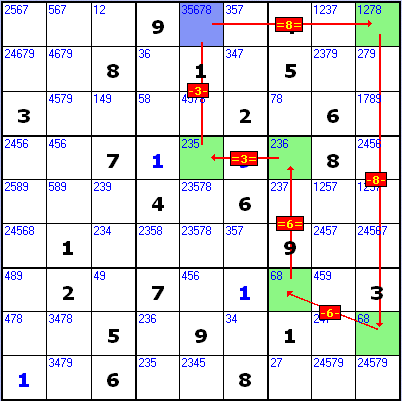
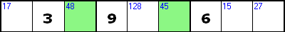
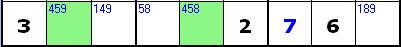
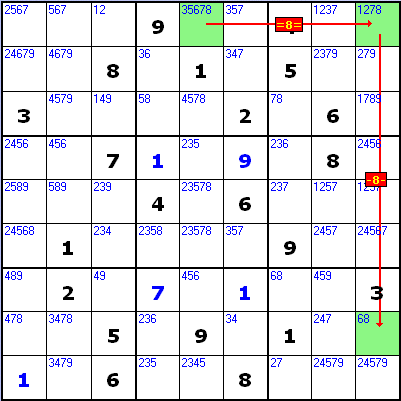
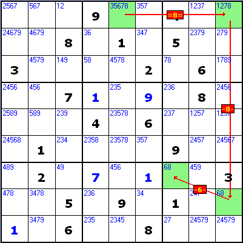
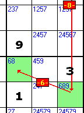

# Nice Loops

Guide Sections

**Nice Loops are the nearest thing Sudoku has to a 'theory of everything' - a universal solving technique that can find most (and often all) of the candidate eliminations needed to complete a hard or extreme puzzle.**

In practice it's normally quicker and easier to find patterns such as pairs, triples and X-Wings, but there are some cases where a Nice Loop is the only (or easiest) way to find the next step in the solution. It's very easy to go wrong when building a Nice Loop though, so you've got to be extremely careful.

## Introduction

A Nice Loop is a chain of squares linked by what-if? inferences (for example, 'if square A contains 4 then square B must contain 6'). Assuming a what-if? value in the first square kicks off a series of results ('...square B must contain 6') all along the chain.

In a Nice Loop the last square links back to the first, creating a closed loop (note - these 'loops' aren't always neatly circular, and often snake all over the puzzle). In some cases the combination of inferences going into and out of the starting square prove a value either impossible or correct for that square, while in others the loop lets you eliminate candidates from other squares in the puzzle.

Nice Loops combine the types of inter-square links used in Conjugate Pair Chains and Forcing patterns, so if you've been using these techniques then you've got a head start. It's the fact that Nice Loops can contain both types of link in a single pattern that makes then so powerful - and so easy to get wrong.

Nice Loops are written using a standard notation. Here's an example:

    [R1C5]=8=[R1C9]-8-[R8C9]-6-[R7C7]=6=[R4C7]=3=[R4C5]-3-[R1C5] => R1C5<>3

and here's the loop in its puzzle:

This loop proves that row 1 column 5 can't contain 3 ('R1C5<>3'). It may look fearsome, but don't worry - a long chain like this is built, step by step, from a series of simple links. Nice Loops are easier than they look (although you do need to be careful!).

## Links and inferences

A link exists between two squares when the squares:

- are related (are in the same row, column or box).
- have a shared ('common') candidate.

Here's an example:

The two green squares are related (in the same row) and have a common candidate (4). They're linked on candidate 4.

When the squares have more than one common candidate, each one counts as a separate link:

Here the green squares have two common candidates (4 and 5). They're linked on 4 and (separately) on 5.

When a link exists, we can make an inference (conclusion) about what solving one of the squares with the link's value would mean for the other square. In the examples above, we can say that if the first green square is solved with 4, then the second one can't be, and vice-versa.  This is called a 'weak' inference, and it represents the basic rule of Sudoku - that if a square contains a particular value, any square that's related to it can't.

As well as weak inferences, some links also let us draw 'strong' inferences. A strong inference occurs when the linked squares contain the only two occurrences of the link's candidate in that area. Here's the first example again:

The green squares contain the only two occurrences of candidate 4 in this row (you may recognise this as a conjugate pair). One of them will have to end up containing 4, so as well as saying that if the first one contains 4 then the other one can't (a weak inference), we can also say that if the first one doesn't contain 4, then the other one must (and vice-versa) - a strong inference.

Key points to remember about links and their inferences:

- A weak inference means 'if square A contains value x then square B can't'.
- A strong inference means  'if square A doesn't contain value x then square B must'.
- An inference is always bi-directional - when you can say 'if square A contains 4 then square B can't', you can also say 'if square B contains 4 then square A can't'.
- When a strong inference exists, a weak inference also exists - when you can say 'if square A doesn't contain 4 then square B must', you can also say 'if square A contains 4 then square B can't' (and vice-versa).

In Nice Loops the terms 'links' and 'inferences' are often used interchangeably, so a 'strong link' is one that has a strong inference (and, by definition, a weak one as well), while a 'weak link' is one that has only a weak inference.

## Nice Loop notation

In Nice Loop notation a link is described by showing its squares, the type of link, and the linking candidate. Here's the Nice Loop notation for the strong link shown above, assuming that it's in row 3 of the puzzle:

    [R3C3]=4=[R3C6]

'R3C3' means 'Row 3, Column 3', while '=' means 'strong link' and 4 is the link's candidate. The order of the squares is important - although the link is bi-directional, in this case we're using it from R3C3  to R3C6 ('if R3C3 isn't 4 then R3C6 must be 4'), and in a Nice Loop that makes a difference.

Here's the Nice Loop notation for the one of the weak links shown above, assuming it's in row 6 of the puzzle:

    [R6C2]-5-[R6C5]

This means 'if R6C2 is 5 then R6C5 can't be', and the '-' signs mean 'weak inference'.

A strong link can act as either a strong or weak link in a Nice Loop (this will depend on the squares that come before and after it). If it's acting as a weak link, you use the weak link notation.

## Chains of inferences

Nice Loops are special forms of a more general pattern called an inference chain (a chain of linked squares where a particular value - or absence of it - in the first square forces a specific set of values into all the other squares in the chain).

Consider this fragment of the complete Nice Loop shown earlier:

    [R1C5]=8=[R1C9]-8-[R8C9]

It means 'if R1C5 isn't 8 then R1C9 must be 8, and if R1C9 is 8 then R8C9 can't be 8'. The key thing to note here is that the result of the first link ('...R1C9 must be 8') forces the square to the right value for the start of the second link ('if R1C9 is 8...') - that's what makes it a chain.

Here's how the chain looks in its puzzle:

(Remember - the strong link ([R1C5]=8=[R1C9]) is true because those squares contain the only two occurrences of candidate 8 in row 1.)

This example proves that if R1C5 doesn't contain 8, then R8C9 can't contain 8 either. The chain isn't a Nice Loop (the last square doesn't link to the first). It does, however, demonstrate an important characteristic of all inference chains - they prove that placing the first inference's value in the first square forces the last square to contain the result of the last inference. In this chain the first inference's value is 'R1C5 doesn't contain 8'. If that's true, then the result of the last inference ('R8C9 can't be 8') will also be true.

This will be important when we start building joined-up Nice Loops. In a loop the first square is also the last square, so the value of the first inference forces an inference result in the same square. Contradictions can occur between the first inference value and the last inference result, proving one of the values true or false.

For now, though, we can extend this chain by adding another link, like this:

The Nice Loop notation now looks like this:

    [R1C5]=8=[R1C9]-8-[R8C9]-6-[R7C7]

However it seems there's a problem. The notation says that 'if R1C9 is 8 then R8C9 can't be 8, and if R8C9 is 6 then R7C7 can't be 6'. But '...R8C9 can't be 8' isn't the right value for the start of an inference that begins 'if R8C9 is 6...'. So how does it work?

It works in this instance for one very important reason - R8C9 has just two candidates (68). If it doesn't contain 8, it will have to contain 6, so the chain is correct.

Squares with just two candidates are called bivalue squares, and are vital for inference chains, because not being able to contain one of their candidates means they must contain the other. This allows you to chain one weak link after another, provided the square in the middle is bivalue, and the links are for different candidates.

The biggest potential mistake when building an inference chain is to get this wrong, and assume that a weak link into a square with more than two candidates has forced it to adopt a particular value. Here's an example:

Here R8C9 has a third candidate (9). Saying '...R8C9 can't be 8' leaves two possible values (6 and 9), so doesn't force it to be 6. The link is therefore wrong.

There are other (slightly more obvious) potential mistakes in loop-building. For example this section:

    [R1C5]=8=[R1C9]-9-[R8C9]

means 'if R1C5 isn't 8 then R1C9 must be 8, and if R1C9 is 9 then R8C9 can't be 9' - an impossible chain of values, since R1C9 being 8 would prevent it from being 9.  Similarly

    [R1C5]=8=[R1C9]=8=[R8C9]

doesn't make sense either (work out the meaning for yourself!).

## Propagation rules

Fortunately there's a set of just three 'propagation rules' that let you check whether the links in a chain are correct. Ignoring the first square for the moment (it's a special case - see below), each square in a joined-up inference chain has two links, one coming in (on the left), the other going out (on the right) The propagation rules are:

- If a square has two weak links, then it must be bivalue (two candidates) and the link candidates must be different.

    Example: **-8-[R8C9]-6-** (...R8C9 can't be 8, and because it's bivalue it must therefore be 6, and if R8C9 is 6...)

- If a square has two strong links, then the links must have different candidates.

    Example: **=6=[R4C7]=3=**  (... R4C7 must be 6, and if R4C7 isn't 3...).

- If a square has one strong and one weak link (in either combination), then the link candidates must be the same.

    Example 1:  **=5=[R5C4]-5-**  (... R5C4 must be 5, and if R5C4 is 5...)
    Example 2:  **-5-[R5C4]=5=**  (... R5C4 can't be 5, and if R5C4 isn't 5...)

When you consider adding a square to an inference chain, check the links that would then surround what is currently the last square. If they satisfy the propagation rules, then the chain is OK. For example, if the chain is currently this:

    [R1C5]=8=[R1C9]-8-[R8C9]-6-[R7C7]

and we want to add another link, to make it this:

    [R1C5]=8=[R1C9]-8-[R8C9]-6-[R7C7]=6=[R4C7]

we look at the links that would then surround R7C7:

    -6-[R7C7]=6=

It's got a weak and a strong link, and they're for the same candidate. That satisfies the 'strong and weak' rule, so the new link is OK.

When you link the penultimate square in a chain to the first to form a Nice Loop, check the links around the penultimate square against the propagation rules. For example, in our example Nice Loop:

    [R1C5]=8=[R1C9]-8-[R8C9]-6-[R7C7]=6=[R4C7]=3=[R4C5]-3-[R1C5]

R4C5 is the penultimate square, and its links (including the one going back to the first square) are:

    =3=[R4C5]-3-

again, a strong and weak link on the same candidate, so OK. As we'll see below, the links that surround the first square (R1C5 in this example) are allowed to break the propagation rules (and provide solving proof when they do), but the links around all the other squares must be valid.

### Check, double check then check again!

When building inference chains, accuracy is absolutely essential (as always in sudoku). One danger with Nice Loop notation is that you can't always tell whether it's correct or not, because the notation alone doesn't tell you whether squares with two weak links are bivalue. This section of our example loop:

    [R1C9]-8-[R8C9]-6-[R7C7]

is correct if R8C9 has two candidates, but incorrect if it has more than two. When you're checking a loop like this, always check the puzzle itself to make sure the relevant squares do, in fact, have exactly two candidates.

A final point (obvious, but worth making) is that squares must actually contain the candidates specified in their links. It's no good saying

    [R4C5]-4-[R4C9] ('if R4C5 is 4 then R4C9 can't be')

if R4C5 doesn't have 4 as a candidate, because that's an impossible situation so doesn't provide solving proof. This is equally true for strong inferences, so saying **[R4C5]=4=[R4C9]** when R4C5 doesn't have candidate 4 isn't valid either.

## Discontinuous Nice Loops

If the penultimate square of an inference chain links back to the first square (making the first square also the last square in the chain), then the chain becomes a Nice Loop. Nice Loops come in two types - discontinuous and continuous. Which type they are depends on the links that surround the first square.

As mentioned above, the first square is a special case, because the links that surround it are allowed to break the propagation rules (although only in the three ways described below). When they do, they create a discontinuous Nice Loop. Here's our full example loop again:

and its Nice Loop notation:

[R1C5]=8=[R1C9]-8-[R8C9]-6-[R7C7]=6=[R4C7]=3=[R4C5]-3-[R1C5]

The first square (shown blue) is R1C5, and appears at both ends of the loop notation. If we 'wrap the notation around' we can see that the links going into and out of R1C5 (i.e. surrounding it) are:

[R4C5]-3-[R1C5]=8=[R1C9]

These links break the propagation rule for a square with a weak and strong link ('must have the same candidate').

That makes this a discontinuous Nice Loop - it links round physically (the penultimate and first squares are related, and have a common candidate), but doesn't link round logically, because it breaks the propagation rules around the first square. This breaking of the rules is called the discontinuity or contradiction.

◊ The discontinuity can, in fact, occur anywhere in the loop, but only one discontinuity (breaking of the propagation rules) is allowed per loop. If you become really skilled at Nice Loop construction, you may be able to 'build backwards' from the first square to connect up to a discontinuity elsewhere in the chain. For now though it's best to stick to having the break only at the first square. 
 

Discontinuous Nice Loop Types - the three ways the first square can break the propagation rules.

A discontinuous Nice Loop only provides solving proof about the square at the discontinuity (i.e. the first square). It provides solving proof by proving that there are no logical circumstances under which the first square either can or can't be solved with a particular value.

Which kind of proof (can or can't) is provided depends on which of the propagation rules has been broken, as follows:

    Type 1. If the first square has two weak links for the same candidate, that candidate can be eliminated from the square.

    Example: -1-[R1C2]-1- ('if R1C2 is 1 then R1C2 can't be 1'). This shows that if you solved R1C2 with 1, the loop would force R1C2 not to be 1. This proves that there are no logical circumstances under which R1C2 can be solved with 1, so you can eliminate 1 as a candidate for R1C2.

    Loop:

    [r1c2]-1-[r3c1]=1=[r9c1]=2=[r9c8]=1=[r1c8]-1-[r1c2] => r1c2<>1

     

    Type 2. If the first square has two strong links with the same candidate, then it can be solved with the links' candidate.

    Example: =8=[R4C2]=8= ('if R4C2 isn't 8 then R4C2 must be 8'). This shows that if you solved R4C2 with anything other than 8, the loop would force R4C2 to be 8. This proves that there are no logical circumstances under which R4C2 can be solved with anything other than 8, so 8 must be the correct value for R4C2.

    Loop:

    [r4c2]=8=[r6c2]=6=[r6c8]-6-[r5c8]-2-[r5c5]=2=[r4c5]=8=[r4c2] => r4c2=8

     

    Type 3. If the first square has a weak link and a strong link with different candidates, then the weak link's candidate can be eliminated from the square.

    Example: -7-[R1C1]=5= ('if R1C1 isn't 5 then it can't be 7'). This shows that if you solved R1C1 with 7 (i.e. not with 5) then the loop would force R1C1 not to be 7. This proves that there are no logical circumstances under which R1C1 can be solved as 7, so 7 can be eliminated as a candidate for R1C1.

    Loop:

    [r1c1]=5=[r1c5]-5-[r6c5]-9-[r6c3]-6-[r2c3]-7-[r1c1] => r1c1<>7

    The weak/strong combination works in the other direction too. If the first square was surrounded like this: =5=[r1c1]-7- ('if R1C1 is 7 than it must be 5') it would show that if you solved R1C1 with 7 then the loop would force R1C1 to be 5. This proves that there are no logical circumstances under which R1C1 can be solved as 7, so 7 can be eliminated as a candidate for R1C1.
     

These rules can be summarised as:

If a propagation rule has been broken and there's a weak link involved, eliminate the weak link's candidate from the first square, otherwise solve the square with the strong links' candidate.

Note that any other breach of the propagation rules on its own simply renders the loop invalid. For example, if a square is surrounded by two weak links on different candidates but is not bivalue, then the link is invalid and the loop doesn't count.

Unlike continuous Nice Loops (see below), discontinuous Nice Loops are always productive, in one of the ways described above. They occur a lot more often than productive continuous loops, so it's worth understanding them.

 

Continuous Nice Loops

In a continuous Nice Loop the penultimate square links back to the first in a way that doesn't make the first square break the propagation rules, so the chain of inferences continues unbroken round the loop.

The first thing to note about a continuous Nice Loop is that it doesn't prove the original proposition right (i.e. if the first square's inference is 'if R3C2 is 5...' and the loop is continuous, that doesn't prove that R3C2 actually is 5, merely that 5 isn't impossible for that square).

In fact, once you've completed a continuous Nice Loop it ceases to have a special 'start/end' square. Instead, all the loop's squares can either have candidate eliminations or be used to eliminate candidates from squares outside the loop, as follows:

    If a square has two strong links with different candidates, then all candidates except those two can be eliminated from the square.
     

    If two squares are joined by a weak link, then the link's candidate can be eliminated from any squares that are related to both of them.

Here's a continuous Nice Loop:

(Note - only the green squares are part of the loop.)

and its Nice Loop notation:

 -[r1c5]=4=[r9c5]=7=[r9c9]-7-[r3c9]-4-[r3c2]=4=[r1c1]-4-[r1c5]=

(When writing a continuous loop, we add our original starting square's outgoing link type (=) to the end of the chain, and its incoming link type (-) to the start of the chain, to show that the loop is continuous.)

This example includes both type of continuous Nice Loop elimination.

R9C5 is surrounded by two strong links, with candidates 4 and 7. All candidates except 4 and 7 (i.e. 2) can be eliminated from R9C5.

R3C2 and R3C9 are joined by a weak link on candidate 4. This candidate can be eliminated from any square that's related to R3C2 and R3C9 (R3C4, shown in yellow).

R3C9 and R9C9 are joined by a weak link on candidate 7. This candidate can be eliminated from any square that's related to R3C9 and R9C9 (R2C9, shown in yellow).

These eliminations work because continuous Nice Loops are fully bidirectional - pick any square in the example above, reverse the arrows and you'll see that the links still work all the way round the loop. This means that a square with two strong links will have to contain one of the links' values (because one of them will end up proving that it '...must be X'), and that one of the two squares joined by a weak link will have to end up containing its value ('... is X').

Redundant loops - beware!

The example loop above is very productive, but beware - puzzles are full of redundant continuous Nice Loops which produce no eliminations and prove only what you already knew, namely that X is a candidate for the start square, but may or may not be its correct value. Here's an example:

Although this loop has plenty of weak links, there are no candidates in the rest of the puzzle waiting to be eliminated by them (another redundant feature would be two strong links around a square that only had those links' candidates, so no extras to eliminate).

Loops like this are similar to the redundant pairs, triples and claims that clog up a gridlocked puzzle (in fact they often describe the same sets of squares). Be aware that a promising chain may turn into a redundant loop, and try to avoid spending too much time on them.

Finding Nice Loops

One of the most powerful (and enjoyable) things about Nice Loops is that you don't need to know what you're looking for when you start building them - instead you can just pick a square and start out on a voyage around your puzzle, making links and seeing where they lead.

If taken to extremes though, this can waste large amounts of time, so it's best to have some aim in mind, and an idea of which squares are likely to make a good chain.

Any square with two or more candidates can act as the start of a Nice Loop. The most commonly-occurring productive loop, however, is the Type 3 discontinuous (a weak and strong link with different values at the discontinuity). These loops typically begin with a strong link from the start square, so look for a square with three or more candidates (to give a better chance of a weak link back in to it), and a conjugate pairing with another square (i.e. the start and second square contain the only two occurrences if the link's candidate in the row, column or box they belong to).  

When you add a square to the chain, work out what kinds of links you can make from it, so you can concentrate on finding squares that fit the requirements. The available link types will depend on the link coming in to the square, as follows:

If the incoming link is weak ('this square can't be X'), then the outgoing link from this square can be:

    A strong link on the same candidate ('if this square isn't X')  - you'll need to find a conjugate pair with this square.

    If this square is bivalue, a weak link on its other candidate ('if this square is Y').
     

If the incoming link is strong ('this square must be X'), then the outgoing link from this square can be:

    A weak link on the same candidate ('if this square is X').

    A strong link on any of this square's other candidates ('if this square isn't Y') - again, you'll need to find a conjugate pair.

Don't forget that, in all cases, you can use a strong link (i.e. where the next square forms a conjugate pair with the current one on the link candidate) as a weak link if you want to - make sure you use the weak link notation (-X-) when you do.

Remember that a link can only be made to a square in the same area (row, column or box) - it's easy to forget this at first!

Once the chain is three or four squares long, start looking for links back to the start square. It's not being close to the first square that counts - it's being in the same area and having a common candidate. Links are often made from one side of the puzzle to the other along a row or column. A skilled loop-builder will look two or three squares ahead, searching for paths that lead to one of the start square's areas.

A chain reaches a dead end if there are no linkable squares from the last one. To keep looking for a loop, remove the last square from the chain, and either try another link from the previous square or, if you've tried all its links, remove that square too, and so on.

 

What about Nice Loops replacing other solving techniques?

If you're familiar with Forcing patterns, then you'll probably have spotted by now that they are, in fact, Nice Loops built entirely of weak links between bivalue squares. A Forcing Chain is a discontinuous Nice Loop, while a Forcing Loop is a continuous Nice Loop.

Nice Loops can also provide an alternative way of reaching the same solving proof as other, non-loop patterns. Here's an example:

The green squares form a row-based X-Wing in the 1s which eliminates candidate 1 from R1C3, R3C9 and R8C9. We can also show these eliminations, using the X-Wing's squares, with these discontinuous Nice Loops:

[R1C3]-1-[R2C3]=1=[R2C9]-1-[R5C9]=1=[R5C3]-1-[R1C3] => R1C3<>1

[R3C9]-1-[R5C9]=1=[R5C3]-1-[R2C3]=1=[R2C9]-1-[R3C9] => R3C9<>1

[R8C9]-1-[R5C9]=1=[R5C3]-1-[R2C3]=1=[R2C9]-1-[R8C9] => R8C9<>1

This is a much more laborious way of doing it, but it does show, through chains of what-if? inferences, exactly why the X-Wing causes the eliminations. When done this way, fish-pattern eliminations are called Fishy Cycles or X-Cycles.

Alternatively, the X-Wing can be described as a single continuous Nice Loop:

-[R2C3]=1=[R2C9]-1-[R5C9]=1=[R5C3]-1-[R2C3]=

The weak links [R5C3]-1-[R2C3] and [R2C9]-1-[R5C9] then eliminate candidate 1 from other squares in columns 3 and 9.

Not all patterns can be represented directly as Nice Loops in this way, but even if a pattern doesn't have a Nice Loop equivalent, the chances are that a Nice Loop can find a candidate elimination at a point where the pattern would otherwise be required.

For example, this puzzle has run out of productive pairs, claims etc, and requires this row-based Swordfish in the 7s to make progress.

The Swordfish can't be translated directly into a Nice Loop, but this alternative Loop finds another way forward:

[R1C4]=7=[R2C5]=6=[R7C5]=4=[R7C4]-4-[R1C4] => R1C4<>4

◊ (Click here to show/hide a text version of this puzzle, which you can paste into SudokuXP or another sudoku program.)

 

Complex Nice Loops

1. Group Nodes

In an inference chain (including Nice Loops) the things that are joined by links are called 'nodes'. So far we've looked at simple Nice Loops, where each node is a single square. However you can also create nodes from multiple squares (called 'group nodes'). This makes the loop more complex (and error-prone) but also far more powerful.

Here's an example:

Nice loop devised by GreenLantern

and its Nice Loop notation:

[r8c8]=3=[r8c4]-3-[r1c4]-2-[r1c9]=2=[r6c9]=9=[r789c9]-9-[r8c8] => r8c8<>9

The loop starts off normally, until it gets round to column 9, and we find this fragment:

[r6c9]=9=[r789c9]

'[r789c9]' means, 'rows 7,8 and 9, column 9' - a reference to three squares. This link means 'if R6C9 isn't 9, then one of those three squares will have to be 9'. Check the puzzle, and you'll see that's true - those are the only other squares in column 9 with candidate 9. What makes them significant is that they're all in the same box (you may recognise this as a column claim into a box). What's more it's the same box as the loop's starting square, so this link:

[r789c9]-9-[r8c8] ('if any of the three squares R789C9 is 9 then R8C8 can't be 9')

is also true. This creates a Type 3 discontinuity (see above) at the starting square.

Finding group nodes is about being aware of the wider implications of inferred values in single squares - 'will eliminating this candidate from this square create a number-claiming pattern somewhere else?', and so on. As well as box/row/column intersection claims (see above), a potential pattern to watch out for is the multi (pairs, triples etc). Here's an example:

[R5C8]-1-[R9C8]-8-[R9C3]-3-[R456C3]-9-[R5C2]-1-[R5C8] => R5C8<>1

The weak link on 3 from R9C3 turns the three red squares into a triple (279), which provides a weak link on 9 into R5C2, which in turn creates a weak link on 1 into R5C8, leaving a Type 1 discontinuity -1-[R5C8]-1- (two weak links on the same candidate).

Note that the weak link from R9C3 (-3-[R456C3]) specifies all three red squares for its result, even though R6C3 doesn't contain candidate 3 - this is so that all three squares of the triple are included to justify the weak link on 9.

This example produces the same elimination as a (slightly mind-boggling) Almost Locked Set pattern in the same squares. All ALS patterns can be expressed as Nice Loops.

Be careful!

Group nodes go a major step beyond conventional solving based on squares which already contain the required patterns of candidates. Instead, you're saying that they would contain them if the previous inference was true - a leap of logical deduction, and one with obvious potential for mistakes.

To avoid errors it's essential to be clear about exactly what a group node means on each end of each type of link, and be sure that the inference is valid on the basis of that meaning. Here are the meanings:

=9=[r789c9] means 'One square in the group R789C9 must be 9, we don't know which one it'll be, and it could be any of them'.

-9-[r789c9] means 'None of the squares in the group R789C9 can be 9'

[r789c9]=9= means 'if none of the squares in the group R789C9 are 9...'

[r789c9]-9- means 'if any one of the squares in the group R789C9 is 9...'

The last one is the most prone to error - you must be sure that the square (or group of squares) on the right-hand end of a weak link from a group node is related to all the squares in the node, otherwise a value in just 'any one' of the node's squares won't force the inference.

As an alternative to the '[r789c9]' format, you can specify each square in a group individually, separated by | symbols (the computer programmer's sign for 'or'). For example, '[R7C9|R8C9|R9C9]' means the same as '[r789c9]'.

2. Multiple inferences.

Another way of creating more powerful Nice Loops is to allow a square to generate multiple inferences. This means saying things like 'if square A is Y then square B can't be Y, and square C can't be Y either' (two weak inferences, one into square B, the other into square C).

Multiple inferences are written like this:

[R1C2](-6-[R2C4])-6-[R2C6]

(note - we've shown the brackets in red to highlight them). This code means 'if R1C2 is 6 then R2C4 and R2C6 can't be 6'. The bit in brackets - (-6-[R2C4]) - is a sub-chain, a dead-end branch of the inference chain which you process before moving on to the next link in the main chain.

Here's an example of multiple inferences in action:

Nice loop devised by GreenLantern

[r3c3]=7=[r3c6]=2=[r9c6]=8=[r8c5]=2=[r8c3](-2-[r3c3])-2-[r1c3]-9-[r3c3]

=> r3c3<>29 => r3c3=7

Things progress normally until we reach R8C3, which must be 2. This creates two weak inferences on 2, one into R3C3 (in brackets), the other into R1C3, forcing it to have a value of 9 and thus creating [R1C3]-9-[R3C3]. 

The effect is to give this loop two discontinuities, -2-[R3C3]=7= and -9-[R3C3]=7=. This allows us to eliminate candidates 2 and 9 for R3C3, leaving it as single-candidate 7.

A sub-chain isn't limited to one link - it can extend for as many squares as you like. A common use for sub-chains is 'scene setting', i.e. putting a square (or squares) into the state needed for a later link in the main loop.

For example, a sub-chain might branch off and eliminate a candidate from a square so that it becomes bivalue, and thus able to sit between two weak links later in the main chain. The word 'later' is all-important here - you must be sure that the sub-chain starts before the link in the main loop that depends on the sub-chain's outcome.

Here's an example of an extremely complex Nice Loop, which includes group nodes and multiple inferences:

Nice loop devised by GreenLantern

[r6c2]-1-[r56c1]=1=[r12c1]-1-[r3c38]-3-[r3c4]-7-[r7c47](-4-[r7c2])(-4-[r7c8])
-8-[r7c8]-5-[r7c2]-1-[r6c2] => r6c2<>1

It may look terrifying, but taken step by step it makes perfect sense:

[r6c2]-1-[r56c1]
If r6c2 is 1, then neither of the squares r56c1 can be (because they're in the same box), so...

[r56c1]=1=[r12c1]
if neither of the squares r56c1 are 1, then one of the squares r12c1 must be, since they're the only other squares in column 1 with candidate 1. So...

[r12c1]-1-[r3c38]
Now it gets tricky. If either of the squares r12c1 is 1, then r3c3 can't be (because it's in the same box). But why 'r3c38', not just 'r3c3'? Because eliminating candidate 1 from r3c3 turns the two squares r3c38 into a pair (23).

This looks 'wrong' at first, because r3c8 isn't related to r12c1, so can't form a link with it. In fact r3c8 isn't part of the link, just part of the pair that is created when the link's inference is applied.

This lets us say...

[r3c38]-3-[r3c4]
Because r3c38 are now a pair on candidates 23, one of them will have to be 3, which means r3c4 can't be. r3c4 is bivalue (37), so...

[r3c4]-7-[r7c47]
This is a rerun of the r3c38 step above. Eliminating candidate 7 from r7c4 makes the two squares r7c47 into a pair (48). Now the multiple inferences start.

[r7c47](-4-[r7c2])
The newly-formed pair in r7c47 eliminates candidate 4 from r7c2. This is a scene-setter, which leaves r7c2 bivalue with candidates 15. We'll see the importance of this soon!

◊ Remember that because this section is in brackets, it's a sub-chain, not part of the main loop. The next inference starts from the last node in the main chain (r7c47), not the last square of the sub-chain.

(-4-[r7c8])
A second scene-setting sub-chain from the pair in r7c47, this time leaving r7c8 bivalue with candidates 58.

 -8-[r7c8]
We're still taking inferences from r7c47, but now we're back in the main loop. This one eliminates candidate 8 from r7c8, which has just been made bivalue (58) by the previous scene-setter. That lets us say...

[r7c8]-5-[r7c2]
r7c2 shows candidates 145 on the puzzle grid, but the scene-setter three steps back left it bivalue (15). So eliminating candidate 5 from it lets us say...

[r7c2]-1-[r6c2]
This makes a Type 1 discontinuous Nice Loop, with the discontinuity (two weak links for the same candidate) around r6c2. Candidate 1 can be eliminated from r6c2, leaving it single-candidate 5.

It's clear how much skill, care and sheer brainpower is needed to build Nice Loops as complex and powerful as this one (note - I didn't build it!) - and how easy it would be to go disastrously wrong. Using group nodes and multiple inferences you can build Nice Loops that will solve virtually any puzzle. However you can solve most puzzles (even extremely tough ones) using simple loops, and it's a good idea to start with them, and make sure you're completely at home with the basics, before tackling the really complex stuff.
 

Further Reading

For further reading, and formal definitions of Nice Loop structures and notation, try these pages at www.sudoku.com's forums:

    Nice Loop definition and rules.
     

    Nice Loop notation.
     

Another definition of Nice Loops, with links to related topics, can be found at Sudopedia.
 

Nice Loops in SudokuXP

SudokuXP's puzzle analyzer/Hint system supports simple Nice Loops (i.e. without group nodes or multiple inferences) up to 10 squares long. When they were introduced, they converted 770 of the 1,000 Outlaw puzzles in SudokuXP's database to logic-solvable Extreme status, showing how effective even relatively straightforward Loops can be.

You can get a puzzle that requires Nice Loops by using the Advanced Puzzle Finder, either from the puzzle page (Get a Puzzle.. Advanced Puzzle Finder) or the main menu. Most Extreme puzzles with difficulty ratings of more than 600 require a series of Nice Loops. The Hint system will show you the loops as they occur (all the images of simple loops in this guide were taken directly from SudokuXP).
 

Finding your own Nice Loops with SudokuXP.

The real satisfaction of Nice Loops comes from finding them yourself. You can use SudokuXP's square colouring tools to help you keep track of the loop you're building.

To use the square colouring tools, click the 'Mouse' radio button:

The mouse controls panel opens. Click on B, G, Y or R (Blue, Green, Red or Yellow) to select a colour. Clicking on a square in the puzzle will now set it to that colour:

To remove a square's colour, click it again.

◊ TIP - when mouse controls are selected, clicking on a square performs the currently-selected action. To place a value in a square or add/remove a candidate, either choose the appropriate action and value in the mouse controls panel then click the square, or click the 'Keyboard' radio button then edit the values by hand.

As you build a loop, keep track of its Nice Loop notation, so you can check its links against the propagation rules. You can do this on paper, but it's better to do it on screen, so you can remove squares when they prove to be dead ends. SudokuXP's Notes area is good for this:

 

Nice Loops - A 'Theory of Everything'?

To demonstrate that Nice Loops can replace most other solving techniques, try this experiment in SudokuXP:

1. Get an Extreme puzzle that requires a mixture of advanced techniques, such as X-Wings, Nishios etc. (TIP - use the Advanced Puzzle Finder to do this).

2. Once the puzzle has loaded, click the 'Puzzle Info' button and choose 'Hint/analyzer options':

3. Check 'Nice Loops' in the list of the list of advanced patterns to check first:

Now step through the puzzle using the Hint button (tip - click Next in the Hint panel to move straight on to the next hint). The chances are that, apart from forced moves (crosshatches and single-candidate squares), the puzzle will be solved entirely by Nice Loops. Try this with a different advanced pattern selected (e.g. XY/XYZ Wings) and it probably won't manage the whole puzzle.

Important - un-check Nice Loops (or any other pattern you've chosen) after you've finished the experiment, otherwise all your puzzles will be solved using Nice Loops.
 

Can you do it better than SudokuXP?

Because SudokuXP supports only simple loops up to 10 squares long, it tends to generate a lot of them (typically 10 or more) to get through the toughest puzzles. Often a longer loop, or a complex one involving group nodes and/or multiple inferences, can get the job done more quickly. Any Extreme puzzle with a rating of 1,000 or more (there are quite a few of them!), and all Outlaws, should be regarded as having potential for complex loops.

Have fun!

Paul Stephens, January 2007.

© Paul Stephens, 2005-2008. All rights reserved. 